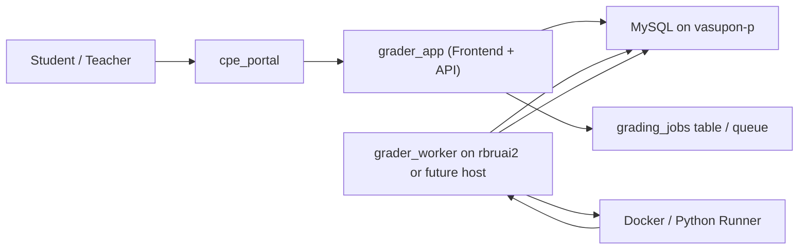
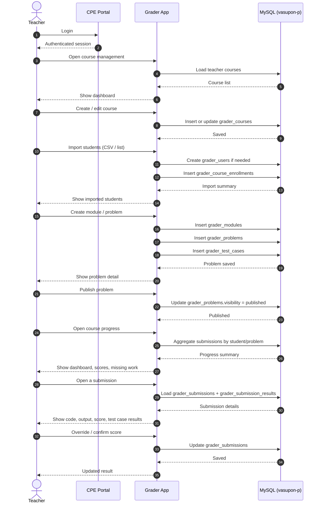
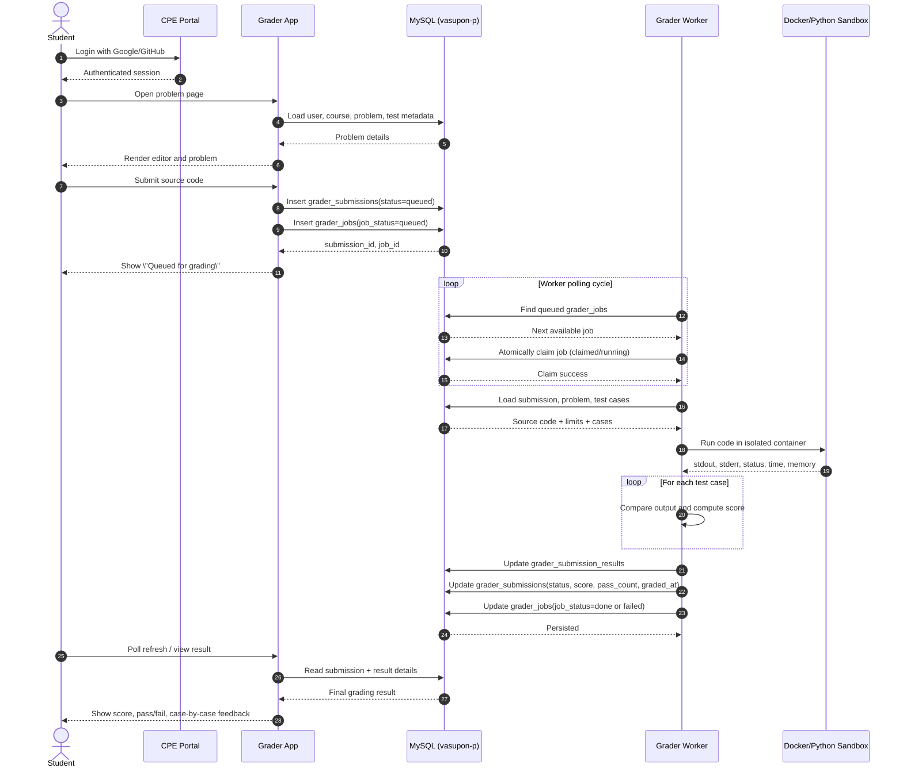
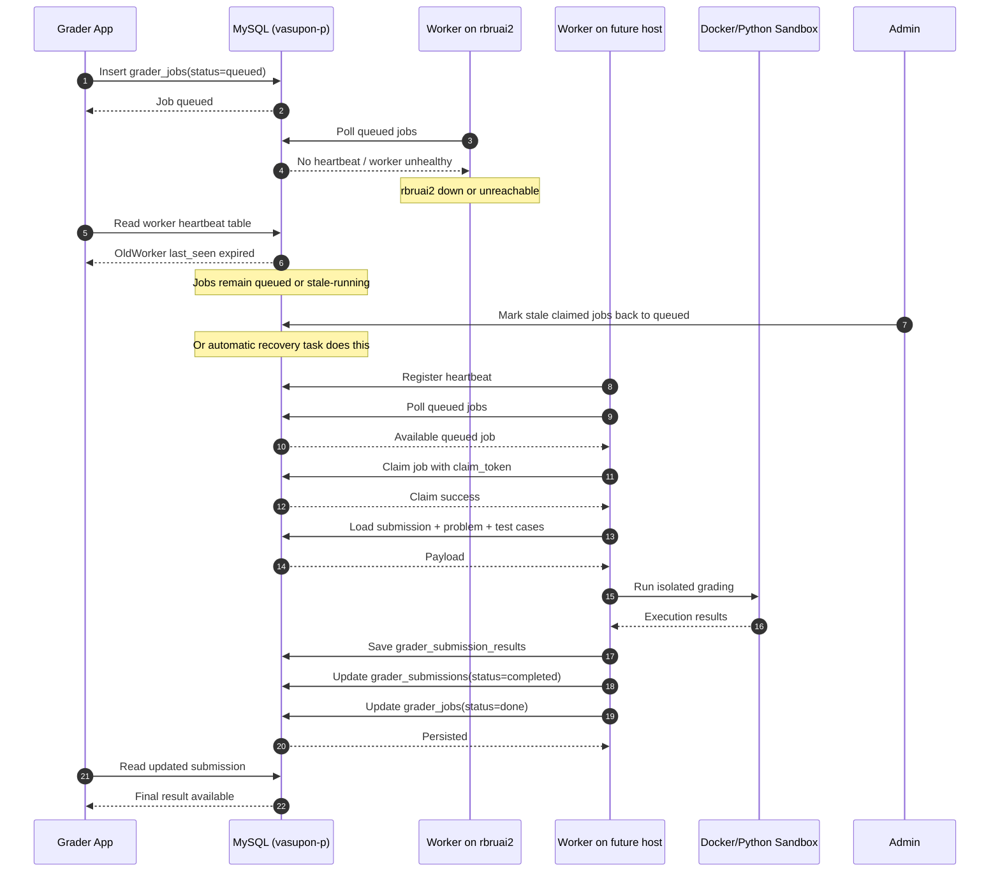

# Grader Technical Design

## Purpose

This document defines the target architecture for a rewritten grading system that can:

- serve students and teachers from the main web server on `vasupon-p.rbru.ac.th`
- run heavy grading workloads on a separate worker host such as `rbruai2.rbru.ac.th`
- survive future worker-host changes with minimal application rewrites
- support both authenticated coursework and limited public/demo usage

The design intentionally separates:

- `portal/auth`
- `grader web + API`
- `database`
- `grading worker`
- `sandbox execution`

## Goals

- Keep the user-facing experience on the main web server.
- Keep Python/Docker execution off the main web server.
- Make worker hosts replaceable through configuration.
- Avoid coupling grading execution directly to a web request.
- Support future integration with `cpe_portal`.
- Support teacher workflows: course management, student import, problem authoring, progress review.
- Support student workflows: coding, submitting, waiting, reviewing result details.

## High-Level Architecture



## Deployment Model

### Main Web Node: `vasupon-p.rbru.ac.th`

Responsibilities:

- `cpe_portal` login and app launcher
- grader frontend
- grader API
- teacher/admin dashboards
- student submission pages
- primary database connection
- reporting and analytics

Should host:

- `cpe_portal`
- `grader_app`
- MySQL or the main reachable application database

Should not host:

- untrusted code execution
- long-running grading jobs
- Docker-based test execution for student code

### Worker Node: `rbruai2.rbru.ac.th` or Future Replacement

Responsibilities:

- polling for queued jobs
- claiming grading work
- running Docker/Python sandbox execution
- returning results to the main database

Should host:

- `grader_worker`
- runner Docker images
- execution-time tooling

Should remain stateless except for local temp files.

## Main Components

### 1. `cpe_portal`

Responsibilities:

- central login
- app launcher
- user role context
- future Google/GitHub OAuth integration

The grader should eventually trust `cpe_portal` as the entry point for authenticated users.

### 2. `grader_app`

Responsibilities:

- student coding interface
- teacher management interface
- submission creation
- result rendering
- progress dashboards
- API endpoints used by the web UI and optionally by the worker control plane

This component should be the source of user-facing business logic.

### 3. Database

The database is the system of record for:

- users mapped from the portal
- courses and enrollments
- problems and test cases
- submissions and grading results
- grading jobs
- worker health / heartbeat metadata

### 4. `grader_worker`

Responsibilities:

- poll or claim jobs from the queue
- load submission/problem/test-case data
- run the sandbox
- compute result details
- update final grading state

The worker must not depend on web sessions or browser state.

### 5. Sandbox Runner

Responsibilities:

- execute code in isolation
- enforce time and memory limits
- capture stdout, stderr, exit status, runtime, memory usage

The web server must never directly run this layer inside request-response flow.

## Data Model

Recommended prefix: `grader_`

### `grader_users`

- `id`
- `portal_user_id`
- `email`
- `full_name`
- `role` (`student`, `teacher`, `admin`)
- `student_code`
- `is_active`
- `created_at`
- `updated_at`

Purpose:

- local grader-facing user profile
- maps portal identity into grader-specific metadata

### `grader_courses`

- `id`
- `course_code`
- `course_name`
- `academic_year`
- `semester`
- `owner_user_id`
- `join_code`
- `status`
- `created_at`
- `updated_at`

Purpose:

- define course containers owned by teachers

### `grader_course_enrollments`

- `id`
- `course_id`
- `user_id`
- `role_in_course`
- `enrolled_at`

Purpose:

- map students and assistants into courses

### `grader_modules`

- `id`
- `course_id`
- `title`
- `description`
- `sort_order`
- `is_active`

Purpose:

- group problems by topic/chapter/week

### `grader_problems`

- `id`
- `module_id`
- `title`
- `slug`
- `description_md`
- `starter_code`
- `language`
- `time_limit_sec`
- `memory_limit_mb`
- `max_score`
- `visibility`
- `sort_order`
- `created_by`
- `created_at`
- `updated_at`

Purpose:

- store problem metadata independent of execution

### `grader_test_cases`

- `id`
- `problem_id`
- `case_type` (`sample`, `hidden`)
- `stdin_text`
- `expected_stdout`
- `score_weight`
- `sort_order`

Purpose:

- store sample and hidden checks with scoring weight

### `grader_submissions`

- `id`
- `problem_id`
- `user_id`
- `course_id`
- `language`
- `source_code`
- `status` (`queued`, `running`, `completed`, `failed`, `cancelled`)
- `score`
- `passed_cases`
- `total_cases`
- `submitted_at`
- `graded_at`

Purpose:

- persistent record of what the student submitted and current grading state

### `grader_submission_results`

- `id`
- `submission_id`
- `test_case_id`
- `status` (`pass`, `fail`, `runtime_error`, `timeout`, `memory_limit`)
- `actual_stdout`
- `stderr_text`
- `execution_time_ms`
- `memory_used_kb`
- `score_awarded`

Purpose:

- detailed case-by-case grading output

### `grader_jobs`

- `id`
- `submission_id`
- `job_status` (`queued`, `claimed`, `running`, `done`, `failed`)
- `runner_target`
- `claimed_by_worker`
- `claim_token`
- `attempt_count`
- `last_error`
- `queued_at`
- `claimed_at`
- `finished_at`

Purpose:

- queue and state machine for grading work

### `grader_workers`

- `id`
- `worker_name`
- `worker_host`
- `worker_token_hash`
- `is_active`
- `last_seen_at`
- `capabilities_json`

Purpose:

- worker registration and health tracking

### `grader_problem_assets`

- `id`
- `problem_id`
- `asset_type`
- `file_path`
- `original_name`

Purpose:

- attach datasets, starter files, or sample materials to problems

### `grader_settings`

- `id`
- `setting_key`
- `setting_value`
- `scope_type`
- `scope_id`
- `updated_at`

Purpose:

- system/course/problem scoped configuration

## Teacher Workflow Design



### Teacher Workflow Notes

- Student import should support CSV and manual add.
- Teacher dashboards should not depend on worker availability.
- Problem publishing should separate authoring from release.
- Score overrides must be auditable.

## Student Submission / Grading Flow



### Submission Flow Notes

- Submission creation must be quick and synchronous.
- Grading itself must be asynchronous.
- The web app should return a queued state immediately.
- The result page should support polling or manual refresh.

## Worker Failover Design



### Failover Notes

- Workers must be stateless.
- Job claim must be atomic.
- Heartbeat must be recorded frequently.
- Stale `claimed/running` jobs must be recoverable.
- Worker replacement should require config changes only, not code rewrites.

## Queue and Execution Strategy

### Recommended Job States

- `queued`
- `claimed`
- `running`
- `done`
- `failed`
- `cancelled`

### Recommended Submission States

- `queued`
- `running`
- `completed`
- `failed`
- `cancelled`

### Recovery Rules

- If a worker claims a job but does not heartbeat within timeout, the job becomes recoverable.
- A scheduled recovery task should requeue stale jobs.
- `attempt_count` should be incremented on each requeue.
- Excessive retries should move jobs to `failed`.

## Security Design

### Web Layer

- never execute student code directly inside request handlers
- validate language and problem ownership
- rate limit submissions
- require authenticated user context for coursework routes

### Worker Layer

- use separate worker token authentication
- isolate execution with Docker
- disable networking for containers
- enforce CPU, memory, and runtime limits
- clean temporary files after each run

### Data Layer

- keep submissions and results in the main database
- log score overrides and important teacher actions
- avoid storing sensitive worker secrets in plain text

## Public Demo Support

The system should support two usage modes:

### Public Demo

- small set of demo problems
- no real academic progress recording
- optional guest-mode submissions

### Authenticated Coursework

- tied to real users and courses
- full submission history
- score aggregation
- teacher review and reporting

Recommended approach:

- mark demo problems with separate visibility or course type
- keep public and coursework submissions distinguishable in the database

## Integration with `cpe_portal`

### Near-Term

- keep grader as a separate app in the portal
- launch from `cpe_portal`
- maintain local user mapping in `grader_users`

### Mid-Term

- unify login through portal identity
- map portal user role to grader role
- support Google/GitHub login at the portal layer

## Rewrite Recommendation

Given the current older Laravel grader:

- retain the domain concepts: courses, chapters/modules, problems, test cases, submissions
- do not keep the current pattern of web request directly running `docker run`
- rebuild execution flow around queued jobs and worker claiming

Recommended target:

- `grader_app` on `vasupon-p`
- `grader_worker` on `rbruai2` or any future worker host
- shared database on the main environment

## Suggested Repository Layout

```text
grader_app/
  bootstrap.php or framework app root
  admin/
  api/
  public/
  db_schema.sql
  README.md

grader_worker/
  worker.py
  config.example
  runners/
  README.md
```

If a framework is chosen for the web app, Laravel remains reasonable for the grader itself because:

- it has richer auth and admin needs than the simpler current apps
- it benefits from queues, migrations, and structured controllers
- it can still coexist with the lighter PHP modules in the portal repo

## Next Design Step

The next implementation artifact should be one of:

1. `grader_*` database schema
2. worker claim protocol
3. API contract for submit / poll / report
4. portal login and role-mapping integration

